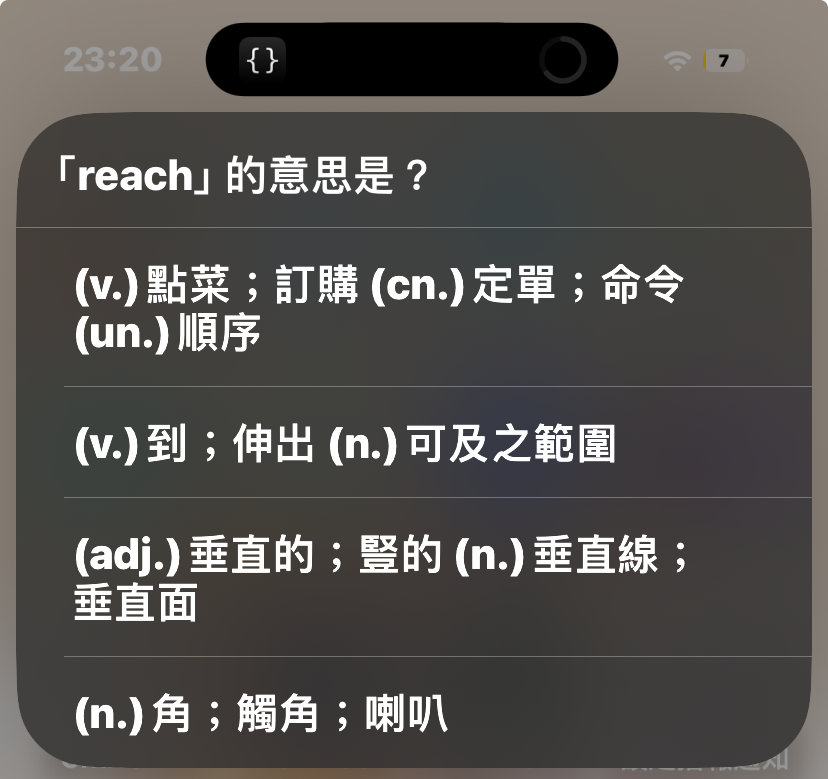
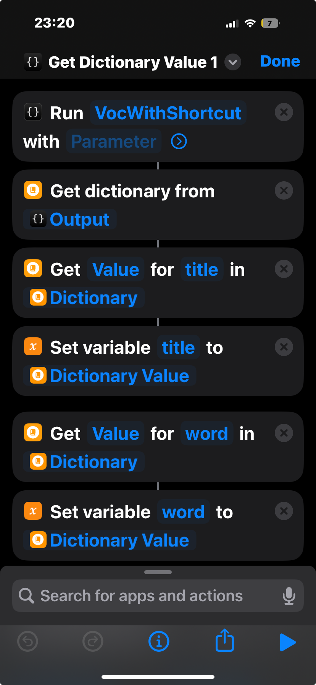
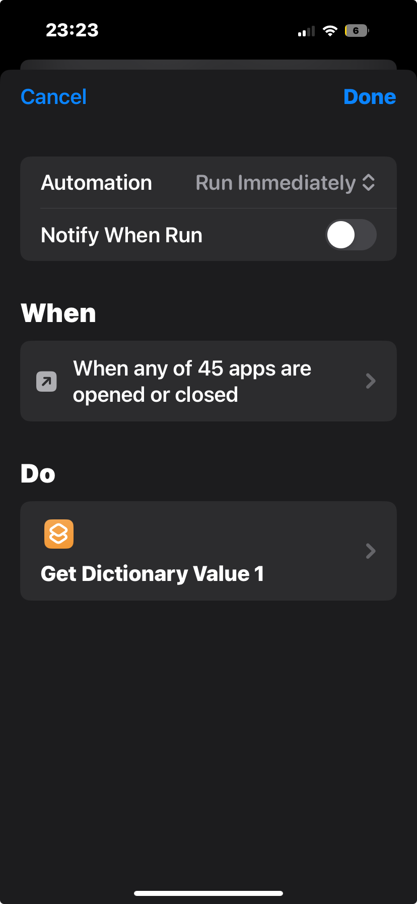

# Scriptable is voc salvation

This project is an iOS vocabulary quiz system that uses **Scriptable** and **Shortcuts**. It can pop up multiple-choice questions either through notifications or directly in Shortcuts, and record wrong answers to iCloud for review.

---

## Features

- Fetches a large number of words daily from a Google Sheet or API (default 500 words)  
- Randomly picks wrong answers for review (default 30% probability)  
- Generates multiple-choice questions in Scriptable  
- Records wrong answers in JSON files in either **iCloud** or **GitHub**
- Fully compatible with iOS Shortcuts for displaying questions and choosing answers  

---

## File Structure

| File | Description |
|------|-------------|
| `daily_words.json` | Full set of words fetched daily |
| `daily_remain.json` | Remaining words that have not been asked yet |
| `wrong_words.json` | Words answered incorrectly, used for review |

---

## Setup

1. Install **Scriptable** from the App Store.  
2. Install **Shortcuts** (built-in iOS app).  
3. Copy the `make_voc_problem` script into Scriptable.  
4. download the Shortcut from [the link](https://www.icloud.com/shortcuts/5243846190b9428181f91854f439a304) and add it to your Shortcuts app.
5. Configure the script and Shortcut as needed (e.g., modify the script name of the problem making script in **Shortcuts**).

6. set the Shortcut to run automatically at your desired time using the Automation feature in Shortcuts.
   1. e.g., set it to run every time you open a specific app like Instagram or games.
   

## Github Integration (Optional)
Since my iCloud storage is almost full, I implemented an option to store wrong answers on GitHub.
To store wrong answers on GitHub and iCloud, follow these steps:
1. Fork this repository to your own GitHub account.
2. Generate a GitHub Personal Access Token (PAT) with `content`'s read and write permissions.
3. In `add_voc_by_url.js`, set `let UPLOAD_TO_GITHUB = 1` and replace the placeholder values for `your_github_token`, `your_github_repo` with your the generated PAT, and repository name respectively.
4. The wrong answers will now be stored in your GitHub repository (voc branch) as well as iCloud.
5. To automately merge daily updates from `auto-update` branch to `main` and `voc` branches, give permission to GitHub Actions `repo → Settings → Actions → General → Workflow permissions → Read and write permissions` in your forked repository.
 
- extra note: Be cautious about exposing your GitHub token, as it grants access to your repository.

